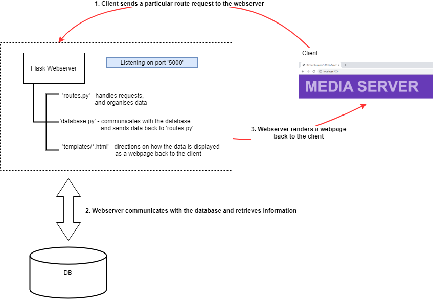

# Media Server: Data and Information Management Project

## Project Overview
**Media Server** is a web-based application designed to manage and track various types of media, including movies, TV shows, songs, and podcasts. The project involves building a database-driven media server that allows users to browse, search, and interact with media items. The application also includes user account management, allowing users to subscribe to podcasts, create playlists, and track their media consumption. The project is divided into several tasks, including SQL query implementation, data handling, data representation, and the addition of new functionalities.

## Key Features
- **Media Management**: Track and display information about movies, TV shows, songs, and podcasts, including metadata such as artwork, descriptions, and genres.
- **User Accounts**: Manage user information, including contact details, subscribed podcasts, and playlists.
- **Search and Filter**: Implement search functionality to allow users to find media items by title, genre, or other attributes.
- **New Functionality**: Add custom features such as user management, playlist creation, and advanced search options.

## Technical Details
- **Programming Language**: Python (for backend logic and database interactions)
- **Database**: SQL (for storing media and user data)
- **Frontend**: HTML, CSS, and JavaScript (for rendering web pages and handling user interactions)
- **Frameworks**: Flask (for routing and web server functionality)

## Project Tasks
1. **SQL Queries**: Implement SQL queries to store, retrieve and display media information, including user-specific data like subscribed podcasts and playlists.

3. **Data Handling**: Complete data handling tasks in the `routes.py` file to manage data flow between the database and the frontend.
4. **Data Representation**: Create HTML templates to display media information, including single-item views for podcasts, songs, and genres.
5. **New Functionality**: Develop new feature, such as user management, playlist creation, and advanced search options, and integrate it into the existing system.

## How It Works
1. **User Login**: Users log in to access their personalized media library, including subscribed podcasts and playlists.
2. **Media Browsing**: Users can browse media items by category (movies, TV shows, songs, podcasts) and view detailed information about each item.
3. **Search and Filter**: Users can search for media items by title, genre, or other attributes, with options for advanced search and filtering.
4. **Custom Features**: Users can create playlists, manage their account details, and interact with additional features like a media player or super user controls.

## Acknowledgments
This project was developed as part of the ISYS2120 course, focusing on database application programming and web development.
